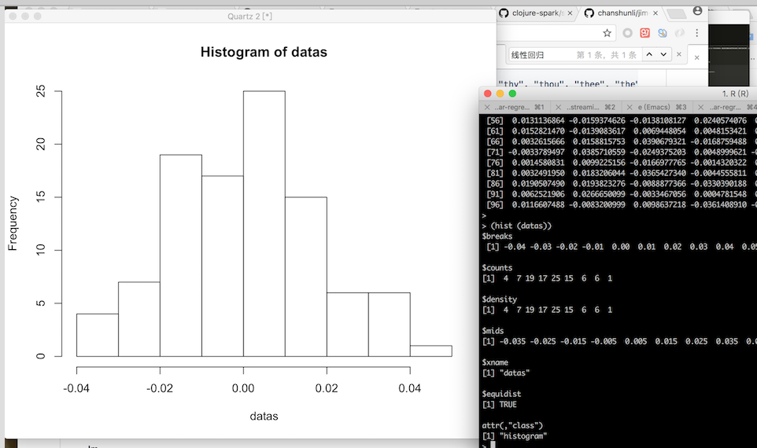

# Clojure实现在线学习Spark Steaming回归分析&贝叶斯, 以及其他机器学习

## sparkling-16-ml (Sparkling 1.2.3 + Spark 2.10 ~ 1.6.0 => 可以很好支持Spark1.6.0, 因为Spark最新版2.2.0对Java的支持不友好, 以及更好的支持中文阅读 《ML with Spark》)

* 事件流处理--完整版(Clojure版本)
```clojure
;; src/sparkling_16_ml/core.clj
(ns sparkling-16-ml.core
  (:gen-class)
  (:require
   [sparkling.conf :as conf]
   [sparkling.core :as spark]
   [sparkling.function :refer [function2]]
   [sparkling.scalaInterop :as scala]
   [clojure.tools.logging :as log])
  (:import
   (org.apache.spark.api.java JavaRDD)
   (sparkinterface VectorClojure)
   (org.apache.spark.mllib.linalg Vectors)
   (org.apache.spark.mllib.regression StreamingLinearRegressionWithSGD LabeledPoint)
   (org.apache.spark.streaming Duration)
   (org.apache.spark.streaming.api.java JavaStreamingContext JavaDStream)))

(defn duration [ms] (Duration. ms))
(defn foreach-rdd [dstream f]
  (.foreachRDD dstream (function2 f)))

(def ssc (JavaStreamingContext. "local[*]" "First Streaming App" (duration 10000)))
;; *SGD 在线学习模型: 
(def model (VectorClojure/linearRegressionodel (double-array (repeat 100 0.0)) 1 0.01))
;; Scala的socket数据流: 通过R数据可视化来分析, 了解哪一个算法才能解决问题, 利用已有包几行代码, 针对数据建预测模型
(def stream (.socketTextStream ssc "localhost" 9999))
;; 事件化数据流: 如果是多种不同的事件流,那么需要多模型同时训练, 共用一个总的事件(如JSON数据)格式化数据流, 然后根据不同的标签, 分发到不同的模型上面训练和实时预测结果
(def labeled-stream
  (spark/map
   (fn [record]
     (let [split (clojure.string/split record #"\t")
           y (Double/parseDouble (nth split 0))
           features (-> (nth split 1) (clojure.string/split #",") ((fn [fs] (map #(Double/parseDouble %) fs))) double-array)]
       (VectorClojure/labeledPoint y features))) stream))

(defn -main
  [& args]
  (do
    ;; 训练模型: model模型 + 数据流事件化标签化(已标记的数据流) => 如果多模型同时训练和预测结果?
    (.trainOn model labeled-stream)
    ;; 预测模型结果: model模型 + labeled-stream的map-to-pair事件流
    (.print
     (.predictOnValues
      model
      (spark/map-to-pair
       (fn [lp]
         (spark/tuple (.label lp) (.features lp)))
       labeled-stream)))
    (.start ssc)
    (.awaitTermination ssc)))

```
* `*SGD`是在线学习模型算法: StreamingLinearRegressionWithSGD线性回归SGD, 贝叶斯SGD, *分类算法SGD
```java
    public static StreamingLinearRegressionWithSGD linearRegressionodel(double [] args, int num, float size) {
        StreamingLinearRegressionWithSGD model = new StreamingLinearRegressionWithSGD()
            .setStepSize(size)
            .setNumIterations(num)
            .setInitialWeights(Vectors.dense(args));
        return model;
    }

```
* `LabeledPoint` 打Label,给特征数据,方便从事件流中取出数据给模型预测: `(spark/tuple (.label lp) (.features lp))`
```java
    public static LabeledPoint labeledPoint(double label, double [] args) {
        LabeledPoint point = new LabeledPoint(label, Vectors.dense(args));
        return point;
    }
```
--------------------------------
```clojure
(defproject sparkling-16-ml "0.1.0-SNAPSHOT"
  :description "FIXME: write description"
  :url "http://example.com/FIXME"
  :license {:name "Eclipse Public License"
            :url "http://www.eclipse.org/legal/epl-v10.html"}
  :dependencies [[org.clojure/clojure "1.8.0"]
                 [gorillalabs/sparkling "1.2.3"]
                 [org.apache.spark/spark-mllib_2.10 "1.6.0"]]
  :aot [#".*" sparkling.serialization sparkling.destructuring sparkling-16-ml.core]
  :main sparkling-16-ml.core
  :profiles {:provided {:dependencies [[org.apache.spark/spark-core_2.10 "1.6.0"]]}
             :dev {:plugins [[lein-dotenv "RELEASE"]]}}
  :java-source-paths ["src/java"])
```

### Usage
* Streaming print (Hello World)
```clojure
(ns sparkling-16-ml.stream-print
  (:gen-class)
  (:require
   [sparkling.conf :as conf]
   [sparkling.core :as spark]
   [sparkling.scalaInterop :as scala])
  (:import
   (org.apache.spark.api.java JavaRDD)
   (sparkinterface VectorClojure)
   (org.apache.spark.mllib.linalg Vectors)
   (org.apache.spark.mllib.regression StreamingLinearRegressionWithSGD LabeledPoint)
   (org.apache.spark.streaming Duration)
   (org.apache.spark.streaming.api.java JavaStreamingContext JavaDStream)))

(defn duration [ms] (Duration. ms))

(def ssc (JavaStreamingContext. "local[*]" "First Streaming App" (duration 10000)))

(def model (VectorClojure/linearRegressionodel (double-array (repeat 100 0.0)) 1 0.01))

(def stream (.socketTextStream ssc "localhost" 9999))

(defn -main
  [& args]
  (do
    (.print stream)
    (.start ssc)
    (.awaitTermination ssc)))
```
* StreamingModelProducer正态分布随机模拟数据源

```scala
object StreamingModelProducer {
  import breeze.linalg._

  def main(args: Array[String]) {

    // Maximum number of events per second
    val MaxEvents = 100
    val NumFeatures = 100

    val random = new Random()

    /** Function to generate a normally distributed dense vector */
    def generateRandomArray(n: Int) = Array.tabulate(n)(_ => random.nextGaussian())

    // Generate a fixed random model weight vector
    val w = new DenseVector(generateRandomArray(NumFeatures))
    val intercept = random.nextGaussian() * 10

    /** Generate a number of random product events */
    def generateNoisyData(n: Int) = {
      (1 to n).map { i =>
        val x = new DenseVector(generateRandomArray(NumFeatures))
        val y: Double = w.dot(x)
        val noisy = y + intercept //+ 0.1 * random.nextGaussian()
        (noisy, x)
      }
    }

    // create a network producer
    val listener = new ServerSocket(9999)
    println("Listening on port: 9999")

    while (true) {
      val socket = listener.accept()
      new Thread() {
        override def run = {
          println("Got client connected from: " + socket.getInetAddress)
          val out = new PrintWriter(socket.getOutputStream(), true)

          while (true) {
            Thread.sleep(1000)
            val num = random.nextInt(MaxEvents)
            val data = generateNoisyData(num)
            data.foreach { case (y, x) =>
              val xStr = x.data.mkString(",")
              val eventStr = s"$y\t$xStr"
              out.write(eventStr)
              out.write("\n")
            }
            out.flush()
            println(s"Created $num events...")
          }
          socket.close()
        }
      }.start()
    }
  }
}
```
* 事件流处理

```clojure

(ns sparkling-16-ml.core
  (:gen-class)
  (:require
   [sparkling.conf :as conf]
   [sparkling.core :as spark]
   [sparkling.function :refer [function2]]
   [sparkling.scalaInterop :as scala]
   [clojure.tools.logging :as log])
  (:import
   (org.apache.spark.api.java JavaRDD)
   (sparkinterface VectorClojure)
   (org.apache.spark.mllib.linalg Vectors)
   (org.apache.spark.mllib.regression StreamingLinearRegressionWithSGD LabeledPoint)
   (org.apache.spark.streaming Duration)
   (org.apache.spark.streaming.api.java JavaStreamingContext JavaDStream)))

(defn duration [ms] (Duration. ms))
(defn foreach-rdd [dstream f]
  (.foreachRDD dstream (function2 f)))

(def ssc (JavaStreamingContext. "local[*]" "First Streaming App" (duration 10000)))
(def model (VectorClojure/linearRegressionodel (double-array (repeat 100 0.0)) 1 0.01))
(def stream (.socketTextStream ssc "localhost" 9999))

(def labeled-stream
  (spark/map
   (fn [record]
     (let [split (clojure.string/split record #"\t")
           y (Double/parseDouble (nth split 0))
           features (-> (nth split 1) (clojure.string/split #",") ((fn [fs] (map #(Double/parseDouble %) fs))) double-array)]
       (VectorClojure/labeledPoint y features))) stream))

(foreach-rdd
 labeled-stream
 (fn [rdd time]
   (let [rcount (.count rdd)]
     (log/info (str "=====rdd: " rdd "=====time: " time "======rcount: " rcount)))))

(defn -main
  [& args]
  (do
    (.start ssc)
    (.awaitTermination ssc)))    
```
* 事件流处理--完整版(Scala版本)
```scala
// import breeze.linalg.DenseVector
import org.apache.spark.mllib.linalg.Vectors
import org.apache.spark.mllib.regression.{StreamingLinearRegressionWithSGD, LabeledPoint}
import org.apache.spark.streaming.{Seconds, StreamingContext}

/**
 * A simple streaming linear regression that prints out predicted value for each batch
 */
object SimpleStreamingModel {

  def main(args: Array[String]) {

    val ssc = new StreamingContext("local[2]", "First Streaming App", Seconds(10))
    val stream = ssc.socketTextStream("localhost", 9999)

//    val NumFeatures = 100
//    val zeroVector = DenseVector.zeros[Double](NumFeatures)
    val zeroVectorData = Array(0.0, 0.0, 0.0, 0.0, 0.0, 0.0, 0.0, 0.0, 0.0, 0.0, 0.0, 0.0, 0.0, 0.0, 0.0, 0.0, 0.0, 0.0, 0.0, 0.0, 0.0, 0.0, 0.0, 0.0, 0.0, 0.0, 0.0, 0.0, 0.0, 0.0, 0.0, 0.0, 0.0, 0.0, 0.0, 0.0, 0.0, 0.0, 0.0, 0.0, 0.0, 0.0, 0.0, 0.0, 0.0, 0.0, 0.0, 0.0, 0.0, 0.0, 0.0, 0.0, 0.0, 0.0, 0.0, 0.0, 0.0, 0.0, 0.0, 0.0, 0.0, 0.0, 0.0, 0.0, 0.0, 0.0, 0.0, 0.0, 0.0, 0.0, 0.0, 0.0, 0.0, 0.0, 0.0, 0.0, 0.0, 0.0, 0.0, 0.0, 0.0, 0.0, 0.0, 0.0, 0.0, 0.0, 0.0, 0.0, 0.0, 0.0, 0.0, 0.0, 0.0, 0.0, 0.0, 0.0, 0.0, 0.0, 0.0, 0.0)
    val model = new StreamingLinearRegressionWithSGD()
      .setInitialWeights(Vectors.dense(zeroVectorData)) //zeroVector.data))
      .setNumIterations(1)
      .setStepSize(0.01)

    // create a stream of labeled points
    val labeledStream = stream.map { event =>
      val split = event.split("\t")
      val y = split(0).toDouble
      val features = split(1).split(",").map(_.toDouble)
      LabeledPoint(label = y, features = Vectors.dense(features))
    }

    // train and test model on the stream, and print predictions for illustrative purposes
    model.trainOn(labeledStream)
    //model.predictOn(labeledStream).print()
    model.predictOnValues(labeledStream.map(lp => (lp.label, lp.features))).print()

    ssc.start()
    ssc.awaitTermination()

  }
}

```
* 查看打印不出来的log, 在repl时: 
```clojure
(def atom-log (atom (list)))
(swap! atom-log conj {:y y :features features})
```
### License

Copyright © 2017 FIXME

Distributed under the Eclipse Public License either version 1.0 or (at
your option) any later version.
